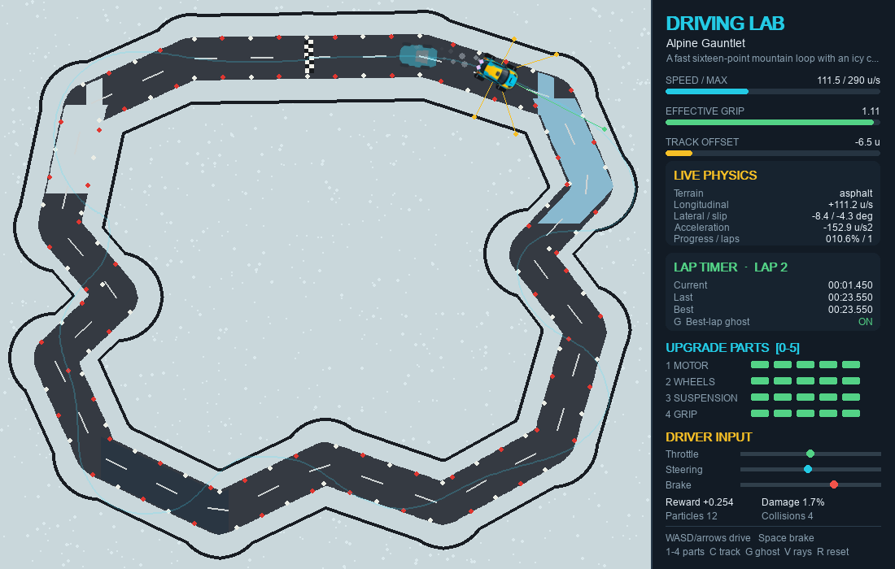
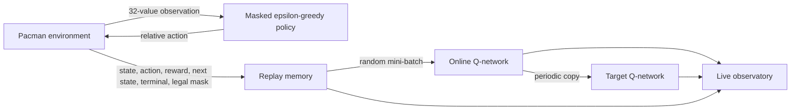

# Late Night Deep Learning

Playable arcade environments for watching reinforcement learning from the inside:

- **Pacman** supports manual play plus real DQN and Double-DQN training with a four-tab live observatory.
- **Snake** compares six deep and tabular value-learning methods with held-out seed evaluation, curriculum randomization, and live generalization metrics.
- **Driving Lab** is a deterministic top-down simulator with five circuits, eight terrain models, fixed-step lap timing, a best-lap ghost, upgradeable car parts, sensor rays, sprite rendering, and particles.


*The animation is captured from a live Double-DQN session. Every score, replay item, chart, activation, Q-value, and weight comes from the running agent.*

| Pacman arcade mode | Snake RL observatory |
|---|---|
|  |  |



For the equations, reward contracts, seed-overfitting discussion, and a fair comparison protocol, see the [learning lab guide](docs/learning-lab.md).

## Quick start

Python 3.10+ is required.

```bash
git clone git@github.com:Juskocode/LateNightDeepLearning.git
cd LateNightDeepLearning

python -m venv .venv
source .venv/bin/activate            # Windows: .venv\Scripts\activate
python -m pip install --upgrade pip
python -m pip install -e .
```

The supported setup is the editable source install above. It registers every
package and launcher while retaining the repository's built-in media and
default model/checkpoint directories. After that one-time step, these commands
work from any directory, including your home folder.

```bash
# Play Pacman manually
python -m pacManRf.main
# or: late-night-pacman

# Open the Pacman Double-DQN observatory
python -m pacManRf.main --rl --algorithm double_dqn
# or: late-night-pacman-rl --algorithm double_dqn

# Open the Snake Double-DQN trainer
python -m snakeGameQDlearning.main --algorithm double_dqn
# or: late-night-snake --algorithm double_dqn

# Play the top-down driving lab
python -m drivingGameRL.main --circuit harbor_loop
# or: late-night-driving --circuit harbor_loop
```

Pacman exposes DQN and Double DQN. Snake additionally exposes dueling variants, tabular Q-learning, and Expected SARSA.

## Pacman arcade mode

| Input | Action |
|---|---|
| Arrow keys or `WASD` | Queue the next direction |
| `Space` | Pause or resume |
| `R` | Restart the game |
| `Esc` | Quit |

Small pellets score 10 points and power pellets score 50. On level one, a power pellet makes ghosts frightened for seven seconds. Consecutive ghosts eaten during one power window score 200, 400, 800, then 1,600 points. Pacman begins with three lives and earns an extra life at 10,000 points.

Clearing the final pellet now moves directly into the next level. Score, high score, lives, extra-life state, weapon unlocks, and cumulative combat statistics survive the transition; only the maze and round-local effects are reset. The RL agent receives a separate **+500 level-clear bonus** on top of the score-derived pellet reward and normal step terms.

Difficulty rises deliberately slowly:

| Level | Ghost speed | Power time | Ghost weapons |
|---:|---:|---:|---|
| 1 | 100% | 7.0 s | Each weapon has an independent 20% early-unlock roll |
| 2 | 101% | 6.9 s | Any level-one early unlock remains active |
| 3 | 102% | 6.8 s | Blinky fireball and Inky freeze ball are guaranteed |

Each later level adds only 1% ghost speed, capped at 120%, and removes only 0.1 seconds of power time, floored at 4.5 seconds.

| Ghost | Strategy |
|---|---|
| Blinky | Chases Pacman's current tile |
| Pinky | Targets four tiles ahead |
| Inky | Flanks using Pacman and Blinky |
| Clyde | Chases at range and retreats when close |

From level three, Blinky and Inky gain visible animated weapon auras:

| Ghost | Projectile | Range | Cooldown | Hit effect |
|---|---|---:|---:|---|
| Blinky (red) | Fireball | 5 tiles | 4.25 s | Removes one life |
| Inky (blue) | Freeze ball | 15 tiles | 5.5 s | Slows Pacman by 15% for 3 seconds |

The two independent 20% early-unlock draws come from the run's seeded RNG, so a level-one run may have neither weapon, either one, or both. The result persists across levels. Shots require a straight, unobstructed corridor; frightened, eaten, and unreleased ghosts cannot fire. Every projectile disappears when it reaches its range limit, strikes Pacman, or collides with a wall. Fire, ice, and impact frames are cached `pygame.sprite.Sprite` assets, while armed ghosts receive animated color-matched auras.

Movement and path decisions operate on grid coordinates while rendering interpolates pixel positions using delta time. Ghosts alternate between timed scatter and chase modes, leave the house on staggered timers, reverse when power mode begins, and return home as animated eyes after being eaten. READY, death, and maze-clear are explicit game phases; score popups are timed state objects rather than blocking delays. Wall contours are generated with vertex-aware joins so concave rails stay connected while true diagonal contacts remain separate.

## Pacman DQN observatory

The RL adapter advances from one grid decision boundary to the next per `step`, independent of rendering speed. Actions are relative to Pacman's heading—**straight**, **turn right**, **turn left**, or **reverse**—and both behavior selection and bootstrap targets mask directions blocked by walls.

Useful run modes:

```bash
# Visual training; automatically resumes the matching checkpoint
python -m pacManRf.main --rl --algorithm double_dqn

# Start at the slowest visual preset
python -m pacManRf.main --rl --speed 1

# Train 100 episodes without opening a window
python -m pacManRf.main --rl --headless --games 100

# Compare standard DQN from a clean model
python -m pacManRf.main --rl --algorithm dqn --fresh

# Evaluate a checkpoint without exploration, updates, or saving
python -m pacManRf.main --rl --algorithm double_dqn --eval

# Stop after a fixed number of headless decisions
python -m pacManRf.main --rl --headless --steps 10_000
```

Visual controls:

| Input | Action |
|---|---|
| `F1` / `F2` / `F3` / `F4` | Open GAME / VISION / METRICS / NETWORK |
| `Tab` or a tab click | Cycle or select views |
| `Space` | Pause or resume training |
| `N` or `.` | Advance one decision while paused |
| `[` / `]` or `-` / `+` | Select the previous or next speed preset |
| `1`–`7` | Jump directly from SLOW to MAX |
| `Home` / `End` | Jump to SLOW or MAX |
| Click the speed scale | Select any preset with the mouse |
| `R` | Reset the current episode |
| `S` | Save a checkpoint immediately |
| `Esc` | Quit; when training, save unless `--no-save` |

The seven visual presets are **1, 5, 15, 30, 60, 120, and 240 fixed simulation frames per second**. Because game physics uses a 60 Hz step, 30 is half speed, 60 is real time, 120 is 2×, and 240 is 4×. The header shows measured versus target simulation FPS and the position on the clickable SLOW-to-MAX scale. `--speed` accepts any starting value in that range; the next speed key moves to the adjacent preset.

The interface continues rendering responsively at 60 FPS while simulation pacing changes independently. Slow presets accumulate fractional physics frames; fast presets process several fixed frames per render. RL actions and learning still occur only at grid decision boundaries. Delayed renders use a bounded catch-up budget and discard excess backlog so one hitch cannot create an update spiral.

### What the Pacman agent sees

The policy receives a named, normalized 32-value vector—not pixels. Directional groups use the egocentric order straight, right, left, reverse.

| Values | Group | Meaning |
|---:|---|---|
| 4 | Paths | Whether each direction is walkable |
| 4 | Pellets | Path-distance proximity to a normal pellet |
| 4 | Power pellets | Path-distance proximity to a power pellet |
| 4 | Threats | Proximity to dangerous ghosts and active projectile rays |
| 4 | Edible ghosts | Proximity to a frightened ghost |
| 4 | Heading | One-hot absolute heading: up, right, down, left |
| 8 | Context | Position, frightened time, pellets left, lives, level, chase mode, and released-ghost ratio |

The VISION tab groups and labels all 32 current values, highlights legal paths and threats, and shows how the relative action frame maps onto Pacman's heading. Projectile danger is merged into the existing four threat values—using five-tile fire and 15-tile freeze rays—so older 32-input checkpoints remain compatible. Nothing in that view is reconstructed from the rendered board; it is the exact observation supplied to the network.

```text
32 observations  →  256 ReLU  →  128 ReLU  →  4 Q-values
```

### What each tab shows

| Tab | Live data |
|---|---|
| GAME | The actual maze, score, combat state, episode, reward, loss, epsilon, replay strip, and online/target Q-values |
| VISION | All named observation features, legal-action mask, current heading, and action-relative sensor groups |
| METRICS | Rolling reward, loss, score, and epsilon charts plus combat telemetry, recent transitions, and replay capacity |
| NETWORK | The current forward-pass activations, learned online-network weights, architecture, parameter count, and online/target Q-values |

The NETWORK tab is model introspection, not a decorative diagram. It runs the current observation through the online model, chooses the 11 strongest-magnitude nodes from each larger layer for readability, and draws the exact learned weights connecting those selected nodes. Layer labels retain the full sizes (`11 / 32`, `11 / 256`, `11 / 128`, and all four outputs). Cyan edges are positive, magenta edges are negative, thickness represents relative magnitude, node intensity represents activation magnitude, and the selected action has a yellow outline. The action bars separately compare the online network with the synchronized target network.

Pacman training defaults:

| Setting | Default |
|---|---:|
| Replay capacity | 100,000 transitions |
| Learning warm-up | 64 transitions |
| Mini-batch | 64 transitions |
| Target synchronization | Every 250 updates |
| Epsilon | 1.00 → 0.05 over 25,000 decisions |
| Level clear reward | +500 plus score-derived reward |
| Freeze-hit reward | -5 |
| Episode boundary | Game over, quit, or 2,000 decisions |
| Network | 32 → 256 → 128 → 4 |

Checkpoints are written atomically to `pacManRf/models/checkpoints/pacman_dqn_latest.pth` or `pacman_double_dqn_latest.pth`. Model, target network, optimizer, counters, random state, and metadata are restored. Replay remains memory-only by default; pass `--save-replay` to include it in the checkpoint or `--no-save` to leave the existing checkpoint untouched.

## Value-learning choices

Pacman and Snake's deep learners use experience replay, a periodically synchronized target network, Huber loss, Adam-family optimization, and gradient clipping. The DQN target rules differ in how they value the next action.

Standard DQN lets the target network both select and evaluate the best legal next action:

```text
y = reward + gamma * max_a Q_target(next_state, a)
```

Double DQN separates those jobs. The online network selects the best legal action and the target network evaluates it:

```text
best_action = argmax_a Q_online(next_state, a)
y = reward + gamma * Q_target(next_state, best_action)
```

That separation reduces the optimistic value bias created by a single maximization estimate. For a controlled comparison, run both with `--fresh --seed N` and switch only `--algorithm dqn` / `--algorithm double_dqn`.

Snake also supports dueling networks, which learn separate state-value and action-advantage streams, plus inspectable tabular Q-learning and online Expected SARSA. These are real interchangeable learning backends, not labels over one trainer. The [learning lab guide](docs/learning-lab.md) derives each target and explains when comparisons are valid.



## Snake generalization lab

The Snake policy receives an 11-value binary vector:

```text
[danger straight, danger right, danger left,
 moving left, moving right, moving up, moving down,
 food left, food right, food up, food down]
```

The first three values are drawn as rays around the snake's head. Red means the probed move collides; green means it is safe. Deep modes use an MLP or dueling MLP; tabular modes use the same 11 bits as a key among at most 2,048 observable states.

```text
MLP:      11 inputs → 512 ReLU → 256 ReLU → 3 Q-values
Dueling:  11 inputs → 512 ReLU → 256 ReLU → value + advantage → 3 Q-values
Tabular:  11 bits   → Q table   → 3 action values
```

Outputs estimate **straight**, **turn right**, and **turn left**. The board also shows the collision probes, dashed food vector, recent path visits, starvation budget, action values, replay state, curriculum stage, held-out mean and variance, and the live train–evaluation gap.

| Algorithm | Representation | Update |
|---|---|---|
| `dqn` | MLP | Target-network maximum |
| `double_dqn` | MLP | Online selection, target evaluation |
| `dueling_dqn` | Value/advantage MLP | DQN target |
| `dueling_double_dqn` | Value/advantage MLP | Double-DQN target |
| `q_learning` | Q table | Off-policy greedy bootstrap |
| `sarsa` | Q table | Online Expected SARSA; no replay |

Training, validation, and final testing use three deterministic seed streams.
Training episodes get new food layouts and increasingly varied valid starts.
Every periodic validation reuses the same fixed suite, while a distinct
final-test suite is reserved for one-time reporting. Evaluation does not train,
consume exploration RNG, or write replay. Training score and mean improvements
may still write checkpoints; once validation-backed checkpoints exist,
best-model loading prefers validation mean instead of training record.

```bash
# Compare from identical train/evaluation roots
python -m snakeGameQDlearning.main --algorithm dueling_double_dqn \
  --headless --games 100 --fresh --no-save --seed 7 --evaluation-seed 9001

# Inspect a compact tabular environment
python -m snakeGameQDlearning.main --algorithm q_learning --environment tutorial

# Evaluate a compatible frozen checkpoint on 20 validation episodes
python -m snakeGameQDlearning.main --algorithm double_dqn \
  --eval-only --eval-episodes 20 --evaluation-seed 9001

# Report once on a separate final-test suite (never used for selection)
python -m snakeGameQDlearning.main --algorithm double_dqn \
  --eval-only --eval-suite final_test --final-test-seed 12001 \
  --final-test-episodes 20

# Slow the renderer for inspection
python -m snakeGameQDlearning.main --speed 30

# Show the optional matplotlib score chart
python -m snakeGameQDlearning.main --plot
```

Educational board presets are `tutorial`, `compact`, `standard`, and `wide`.
Use `--no-domain-randomization` for the classic fixed start, `--no-curriculum`
for immediate full randomization, or `--eval-every 0` to disable periodic
validation. Snake models and algorithm-tagged metadata are versioned under
`snakeGameQDlearning/models/saved_models/`; each new checkpoint records its
environment, experiment settings, validation round, and exact
validation/final-test seed lists. With no explicit validation override,
`--eval-only` reuses a compatible checkpoint's recorded validation suite.

Snake checkpoints restore the learned network weights or Q table and episode
metadata, but not optimizer state, replay contents, learner RNG state, or
target-sync counters. Training continuation is therefore not bit-for-bit
reproducible. Greedy evaluation remains reproducible because it needs only the
frozen policy and recorded suite. `--no-save` guarantees comparison runs do not
write checkpoints. See the dedicated [Snake guide](snakeGameQDlearning/README.md)
for the full matrix.

## 2D driving physics lab

```bash
# Drive manually
python -m drivingGameRL.main --circuit harbor_loop

# Deterministic upgraded-car autopilot without a window
python -m drivingGameRL.main --headless --circuit pine_sprint --steps 1_000 \
  --motor 2 --wheels 2 --suspension 2 --grip 2 --seed 11

# Show every available circuit
python -m drivingGameRL.main --list-circuits
```

| Input | Action |
|---|---|
| `WASD` or arrows | Throttle/reverse and steer |
| `Space` | Brake |
| `1` / `2` / `3` / `4` | Cycle motor, wheels, suspension, or grip level |
| `C` | Cycle circuit |
| `G` | Toggle the best-lap ghost and racing line |
| `V` | Toggle five live sensor rays |
| `R` | Reset the car and current run; retain in-session circuit records |
| `F12` | Save `driving-screenshot.png` |

The five circuits are Harbor Loop, Pine Sprint, Desert Switchback, Alpine Gauntlet, and Canyon Maze. The latter two add narrow, corner-dense layouts: Alpine Gauntlet combines ice, wet asphalt, and snow, while Canyon Maze combines gravel, sand, wet asphalt, and sandy runoff. Across the lab, asphalt, wet asphalt, gravel, grass, mud, sand, snow, and ice each have distinct grip, rolling-resistance, engine-efficiency, color, and tire-particle behavior.

The HUD counts completed laps and shows current, last, and best lap times. Timing advances by the environment's fixed simulation step, so the same action sequence produces the same lap time independently of the display FPS. Ordered quarter-lap gates and a forward start-line crossing reject reverse driving, line oscillation, and projection shortcuts. The first valid lap on a circuit establishes an in-session record; a faster lap replaces it and supplies the translucent ghost and racing line for following laps. Records are kept separately for each circuit when `R` resets the car or `C` changes tracks, but a new process starts with no records. The ghost is a presentation-only replay: it never collides with the car and does not alter physics, observations, rewards, or particles. Press `G` to hide or show it, or start with `--no-ghost`.

Each component has levels 0–5 and changes actual physics:

| Component | Improves |
|---|---|
| Motor | Acceleration and maximum speed |
| Wheels | Steering angle and steering response |
| Suspension | Yaw response and lateral recovery |
| Grip | Tire grip, cornering authority, and lateral recovery |

The reusable `DrivingEnv` returns 12 normalized observations: speed, longitudinal/lateral velocity, heading error, track offset, terrain grip, lap progress, and five barrier rays. Its five discrete actions are coast, accelerate, brake, steer left, and steer right; continuous `DriverControls` power manual play. The renderer uses an alpha-cropped car-body asset with procedural wheel/suspension layers and a code-only fallback. Seeded, bounded particles visualize gravel/mud spray, tire slip, braking, and barrier impacts without affecting physics.

## CLI reference

```bash
python -m pacManRf.main --help
python -m snakeGameQDlearning.main --help
python -m drivingGameRL.main --help
```

In the editable source install, built-in assets and default model/checkpoint
locations are resolved from the repository checkout. User-supplied output and
custom checkpoint paths are resolved from the current directory.

## Project layout

```text
LateNightDeepLearning/
├── pyproject.toml
├── assets/
│   ├── fonts/
│   ├── gifs/                   # Live README capture
│   ├── screenshots/
│   └── sprites/
├── pacManRf/
│   ├── main.py                 # Manual and RL CLI
│   ├── models/checkpoints/
│   └── src/
│       ├── game/               # Arcade rules, sprites, RL environment
│       ├── ml/                 # Networks, replay, DQN/DDQN trainer, agent
│       ├── visualization/      # GAME/VISION/METRICS/NETWORK observatory
│       ├── observatory_capture.py
│       └── rl_session.py
├── snakeGameQDlearning/
│   ├── main.py
│   ├── models/
│   └── src/
│       ├── game/
│       ├── ml/
│       └── utils/
├── drivingGameRL/
│   ├── main.py                 # Play, headless simulation, screenshot CLI
│   └── src/                    # Circuits, terrain, physics, sprites, HUD, env
├── docs/
│   └── learning-lab.md         # Algorithms, equations, experiment protocol
├── late_night_deep_learning/   # Portable project test launcher
└── tests/
```

## Tests and documentation images

Run the full behavioral suite from any directory after the editable install:

```bash
late-night-tests -v
# or: python -m late_night_deep_learning.test_runner -v
```

`python -m unittest discover -v` also works from the repository root. Standard discovery searches the current directory, so running it from `~` correctly finds zero project tests.

Coverage includes Pacman contour/combat/level/RL behavior; Snake algorithms, dueling heads, tabular updates, held-out evaluation, seed streams, curricula, checkpoint compatibility, and environment edge cases; and driving circuit geometry, terrain physics, gated lap records, ghost interpolation, component effects, collisions, finite stress simulation, sprite fallback, bounded particles, screenshots, and renderer smoke tests.

Regenerate documentation media from the real renderers:

```bash
python -m pacManRf.main \
  --seed 1 --screenshot assets/screenshots/pacman-gameplay.png

python -m pacManRf.main \
  --rl --algorithm double_dqn --fresh --no-save --seed 1 \
  --gif assets/gifs/pacman-dqn-observatory.gif

python -m snakeGameQDlearning.main \
  --algorithm dueling_double_dqn --fresh --no-save --seed 1 \
  --eval-episodes 4 \
  --screenshot assets/screenshots/snake-observatory.png

python -m drivingGameRL.main \
  --circuit alpine_gauntlet --motor 5 --wheels 5 --suspension 5 --grip 5 \
  --seed 19 --steps 1500 --screenshot assets/screenshots/driving-lab.png
```

## Design notes

- Game state, learning logic, rendering, sprites, replay storage, and observability have separate responsibilities.
- All three environments accept seeds; Pacman decisions and driving physics are fixed-step and deterministic for testing.
- Headless and visual runs use the same environment and selected learning backend. Neural modes also share replay and optimizer paths; Expected SARSA intentionally skips replay-based updates.
- Neural-network visuals are generated from current parameters and activations; missing telemetry renders an explicit empty state instead of invented values.
- Driving physics is independent of Pygame; rendering, generated body art, procedural upgrade layers, and particles are presentation-only.
- Runtime checkpoints and generated training models are ignored by Git.
