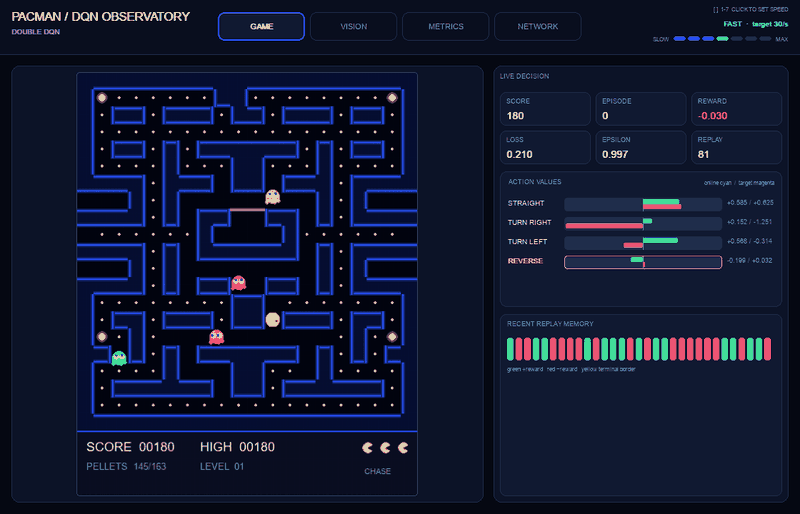
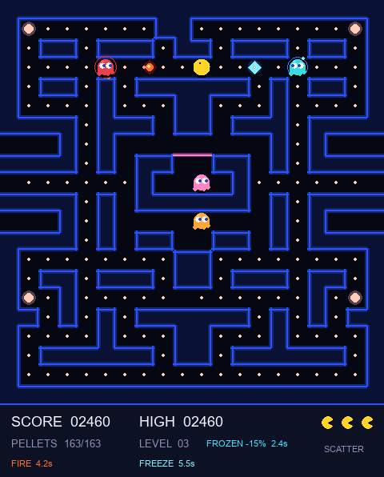
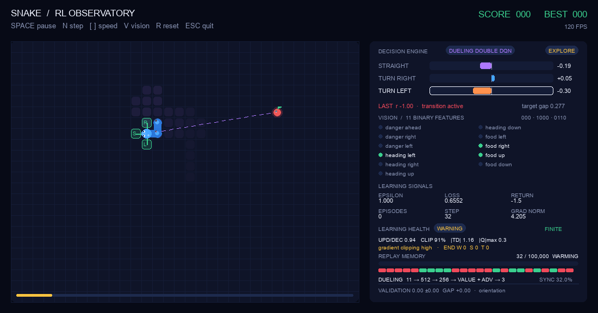
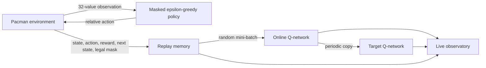

# Late Night Deep Learning

Playable arcade environments for watching reinforcement learning from the inside:

- **Pacman** supports manual play plus real DQN and Double-DQN training with a four-tab live observatory.
- **Snake** trains DQN or Double DQN while exposing its vision rays, action values, replay memory, reward, loss, and exploration schedule.



*The animation is captured from a live Double-DQN session. Every score, replay item, chart, activation, Q-value, and weight comes from the running agent.*

| Pacman arcade mode | Snake RL observatory |
|---|---|
|  |  |

## Quick start

Python 3.10+ is recommended.

```bash
git clone git@github.com:Juskocode/LateNightDeepLearning.git
cd LateNightDeepLearning

python -m venv .venv
source .venv/bin/activate            # Windows: .venv\Scripts\activate
python -m pip install --upgrade pip
python -m pip install -e .
```

The editable install registers every package and launcher. After that one-time step, these commands work from any directory, including your home folder.

```bash
# Play Pacman manually
python -m pacManRf.main
# or: late-night-pacman

# Open the Pacman Double-DQN observatory
python -m pacManRf.main --rl --algorithm double_dqn
# or: late-night-pacman-rl --algorithm double_dqn

# Open the Snake Double-DQN trainer
python -m snakeGameQDlearning.main --algorithm double_dqn
# or: late-night-snake --algorithm double_dqn
```

Use `--algorithm dqn` with either learner to run standard DQN instead.

## Pacman arcade mode

| Input | Action |
|---|---|
| Arrow keys or `WASD` | Queue the next direction |
| `Space` | Pause or resume |
| `R` | Restart the game |
| `Enter` or `N` | Start the next maze after a clear |
| `Esc` | Quit |

Small pellets score 10 points and power pellets score 50. A power pellet makes ghosts frightened for seven seconds. Consecutive ghosts eaten during one power window score 200, 400, 800, then 1,600 points. Pacman begins with three lives, earns an extra life at 10,000 points, and advances to progressively faster mazes after every clear.

| Ghost | Strategy |
|---|---|
| Blinky | Chases Pacman's current tile |
| Pinky | Targets four tiles ahead |
| Inky | Flanks using Pacman and Blinky |
| Clyde | Chases at range and retreats when close |

Animation frames are cached in `pygame.sprite.Sprite` objects. Rules operate on grid coordinates while rendering interpolates pixel positions using delta time. Ghosts alternate between timed scatter and chase modes, leave the house on staggered timers, reverse when power mode begins, and return home as animated eyes after being eaten. READY, death, maze-clear, and score-popup phases are explicit states rather than blocking delays.

## Pacman DQN observatory

The RL adapter advances exactly one grid-cell decision per `step`, independent of rendering speed. Actions are relative to Pacman's heading—**straight**, **turn right**, **turn left**, or **reverse**—and both behavior selection and bootstrap targets mask directions blocked by walls.

Useful run modes:

```bash
# Visual training; automatically resumes the matching checkpoint
python -m pacManRf.main --rl --algorithm double_dqn

# Train 100 episodes without opening a window
python -m pacManRf.main --rl --headless --games 100

# Compare standard DQN from a clean model
python -m pacManRf.main --rl --algorithm dqn --fresh

# Evaluate a checkpoint without exploration, updates, or saving
python -m pacManRf.main --rl --algorithm double_dqn --eval

# Stop after a fixed number of headless decisions
python -m pacManRf.main --rl --headless --steps 10_000
```

Visual controls:

| Input | Action |
|---|---|
| `F1` / `F2` / `F3` / `F4` | Open GAME / VISION / METRICS / NETWORK |
| `Tab` or a tab click | Cycle or select views |
| `Space` | Pause or resume training |
| `N` or `.` | Advance one decision while paused |
| `[` / `]` | Halve or double decisions per second |
| `R` | Reset the current episode |
| `S` | Save a checkpoint immediately |
| `Esc` | Save and quit |

### What the Pacman agent sees

The policy receives a named, normalized 32-value vector—not pixels. Directional groups use the egocentric order straight, right, left, reverse.

| Values | Group | Meaning |
|---:|---|---|
| 4 | Paths | Whether each direction is walkable |
| 4 | Pellets | Path-distance proximity to a normal pellet |
| 4 | Power pellets | Path-distance proximity to a power pellet |
| 4 | Threats | Proximity to a released dangerous ghost |
| 4 | Edible ghosts | Proximity to a frightened ghost |
| 4 | Heading | One-hot absolute heading: up, right, down, left |
| 8 | Context | Position, frightened time, pellets left, lives, level, chase mode, and released-ghost ratio |

The VISION tab groups and labels all 32 current values, highlights legal paths and threats, and shows how the relative action frame maps onto Pacman's heading. Nothing in that view is reconstructed from the rendered board; it is the exact observation supplied to the network.

```text
32 observations  →  256 ReLU  →  128 ReLU  →  4 Q-values
```

### What each tab shows

| Tab | Live data |
|---|---|
| GAME | The actual maze, score, episode, reward, loss, epsilon, replay strip, and online/target Q-values |
| VISION | All named observation features, legal-action mask, current heading, and action-relative sensor groups |
| METRICS | Rolling reward, loss, score, and epsilon charts plus recent transitions and replay capacity |
| NETWORK | The current forward-pass activations, learned online-network weights, architecture, parameter count, and online/target Q-values |

The NETWORK tab is model introspection, not a decorative diagram. It runs the current observation through the online model, chooses the 11 strongest-magnitude nodes from each larger layer for readability, and draws the exact learned weights connecting those selected nodes. Layer labels retain the full sizes (`11 / 32`, `11 / 256`, `11 / 128`, and all four outputs). Cyan edges are positive, magenta edges are negative, thickness represents relative magnitude, node intensity represents activation magnitude, and the selected action has a yellow outline. The action bars separately compare the online network with the synchronized target network.

Pacman training defaults:

| Setting | Default |
|---|---:|
| Replay capacity | 100,000 transitions |
| Learning warm-up | 64 transitions |
| Mini-batch | 64 transitions |
| Target synchronization | Every 250 updates |
| Epsilon | 1.00 → 0.05 over 25,000 decisions |
| Episode boundary | Life loss, maze clear, game over, or 2,000 decisions |
| Network | 32 → 256 → 128 → 4 |

Checkpoints are written atomically to `pacManRf/models/checkpoints/pacman_dqn_latest.pth` or `pacman_double_dqn_latest.pth`. Model, target network, optimizer, counters, random state, and metadata are restored. Replay remains memory-only by default; pass `--save-replay` to include it in the checkpoint or `--no-save` to leave the existing checkpoint untouched.

## DQN versus Double DQN

Both games use experience replay, a periodically synchronized target network, Huber loss, Adam-family optimization, and gradient clipping. The algorithms differ in how they value the next action.

Standard DQN lets the target network both select and evaluate the best legal next action:

```text
y = reward + gamma * max_a Q_target(next_state, a)
```

Double DQN separates those jobs. The online network selects the best legal action and the target network evaluates it:

```text
best_action = argmax_a Q_online(next_state, a)
y = reward + gamma * Q_target(next_state, best_action)
```

That separation reduces the optimistic value bias created by a single maximization estimate. Use the same seed and switch only `--algorithm dqn` / `--algorithm double_dqn` for a direct comparison.



## Snake RL observatory

The Snake policy receives an 11-value binary vector:

```text
[danger straight, danger right, danger left,
 moving left, moving right, moving up, moving down,
 food left, food right, food up, food down]
```

The first three values are drawn as rays around the snake's head. Red means the probed move collides; blue means it is safe. The observation passes through:

```text
11 inputs  →  512 ReLU  →  256 ReLU  →  3 Q-values
```

Outputs estimate **straight**, **turn right**, and **turn left**. The board also shows the collision probes, dashed food vector, recent path visits, starvation budget, online and target values, exploration/exploitation mode, recent replay, and training metrics.

```bash
# Headless training
python -m snakeGameQDlearning.main --headless --games 100

# Start without loading the current best checkpoint
python -m snakeGameQDlearning.main --fresh

# Slow the renderer for inspection
python -m snakeGameQDlearning.main --speed 30

# Show the optional matplotlib score chart
python -m snakeGameQDlearning.main --plot
```

Snake models and metadata are versioned under `snakeGameQDlearning/models/saved_models/`; a new version is saved when a score record is achieved.

## CLI reference

```bash
python -m pacManRf.main --help
python -m snakeGameQDlearning.main --help
```

All asset, model, and checkpoint paths are resolved from the repository instead of the current working directory.

## Project layout

```text
LateNightDeepLearning/
├── pyproject.toml
├── assets/
│   ├── fonts/
│   ├── gifs/                   # Live README capture
│   ├── screenshots/
│   └── sprites/
├── pacManRf/
│   ├── main.py                 # Manual and RL CLI
│   ├── models/checkpoints/
│   └── src/
│       ├── game/               # Arcade rules, sprites, RL environment
│       ├── ml/                 # Networks, replay, DQN/DDQN trainer, agent
│       ├── visualization/      # GAME/VISION/METRICS/NETWORK observatory
│       ├── observatory_capture.py
│       └── rl_session.py
├── snakeGameQDlearning/
│   ├── main.py
│   ├── models/
│   └── src/
│       ├── game/
│       ├── ml/
│       └── utils/
├── late_night_deep_learning/   # Portable project test launcher
└── tests/
```

## Tests and documentation images

Run the full behavioral suite from any directory after the editable install:

```bash
late-night-tests -v
# or: python -m late_night_deep_learning.test_runner -v
```

`python -m unittest discover -v` also works from the repository root. Standard discovery searches the current directory, so running it from `~` correctly finds zero project tests.

Coverage includes Pacman maze and life rules, deterministic RL transitions, the normalized observation contract, legal-action target masking, DQN versus Double-DQN bootstrap behavior, bounded/serializable replay, checkpoint round trips, real network telemetry, all observatory tabs, animated GIF output, Snake edge cases, renderer smoke tests, and finite learning updates.

Regenerate documentation media from the real renderers:

```bash
python -m pacManRf.main \
  --screenshot assets/screenshots/pacman-gameplay.png

python -m pacManRf.main \
  --rl --algorithm double_dqn --fresh --no-save \
  --gif assets/gifs/pacman-dqn-observatory.gif

python -m pacManRf.main \
  --rl --algorithm double_dqn --fresh --no-save --tab network \
  --screenshot assets/screenshots/pacman-network.png

python -m snakeGameQDlearning.main \
  --algorithm double_dqn --fresh \
  --screenshot assets/screenshots/snake-observatory.png
```

## Design notes

- Game state, learning logic, rendering, sprites, replay storage, and observability have separate responsibilities.
- Both environments accept seeds; Pacman decisions are also fixed-step and deterministic for testing.
- Headless and visual training use the same environment, replay, policy, and optimizer paths.
- Neural-network visuals are generated from current parameters and activations; missing telemetry renders an explicit empty state instead of invented values.
- Runtime checkpoints and generated training models are ignored by Git.
