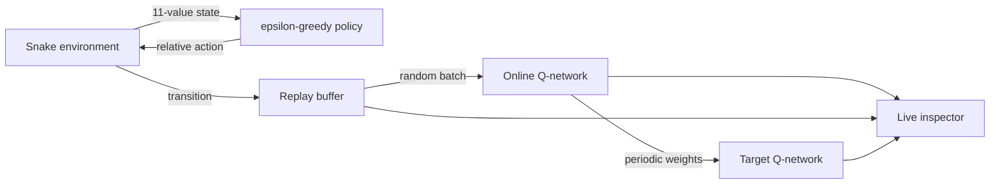

# Late Night Deep Learning

Two small games for seeing game loops and reinforcement learning from the inside:

- **Pacman** is a complete sprite-driven arcade loop with pellets, power mode, four ghost strategies, tunnels, lives, scoring, pause, win, and game-over states.
- **Snake RL Observatory** trains either DQN or Double DQN while showing the agent's observation, decision values, exploration rate, reward, loss, and replay memory in real time.

| Pacman | Snake RL Observatory |
|---|---|
|  |  |

## Quick start

Python 3.10+ is recommended.

```bash
git clone git@github.com:Juskocode/LateNightDeepLearning.git
cd LateNightDeepLearning

python -m venv .venv
source .venv/bin/activate            # Windows: .venv\Scripts\activate
python -m pip install --upgrade pip
python -m pip install -e .
```

The editable install registers the packages and launchers. After that one-time
step, the game commands work from **any directory**, including your home folder.

Run Pacman:

```bash
python -m pacManRf.main
# or: late-night-pacman
```

Run the visual Double-DQN trainer:

```bash
python -m snakeGameQDlearning.main --algorithm double_dqn
# or: late-night-snake --algorithm double_dqn
```

Run standard DQN instead:

```bash
python -m snakeGameQDlearning.main --algorithm dqn
```

## Pacman controls and rules

| Input | Action |
|---|---|
| Arrow keys or `WASD` | Queue the next direction |
| `Space` | Pause or resume |
| `R` | Restart the game |
| `Enter` or `N` | Start the next maze after a clear |
| `Esc` | Quit |

Small pellets score 10 points and power pellets score 50. A power pellet makes
ghosts frightened for seven seconds. Consecutive ghosts eaten during one power
window score 200, 400, 800, then 1,600 points. Pacman begins with three lives,
earns an extra life at 10,000 points, and advances to progressively faster mazes
after every clear.

The ghosts share movement mechanics but not targets:

| Ghost | Strategy |
|---|---|
| Blinky | Chases Pacman's current tile |
| Pinky | Targets four tiles ahead |
| Inky | Flanks using Pacman and Blinky |
| Clyde | Chases at range and retreats when close |

Animation frames are cached in `pygame.sprite.Sprite` objects. Game rules operate on grid coordinates while rendering interpolates pixel positions using delta time. This keeps collision and path logic deterministic without sacrificing smooth animation.

Ghosts alternate between timed **scatter** and **chase** modes, leave the ghost
house on staggered timers, reverse when power mode begins, and return home as
animated eyes after being eaten. READY, death, maze-clear, and score-popup phases
are explicit game states rather than blocking delays.

## What the Snake agent sees

The policy does **not** receive the board image. Its “vision” is an 11-value binary vector:

```text
[danger straight, danger right, danger left,
 moving left, moving right, moving up, moving down,
 food left, food right, food up, food down]
```

The first three values are also drawn as rays around the snake's head. Red means that the probed move collides; blue means it is currently safe. This compact observation is passed through:

```text
11 inputs  →  512 ReLU  →  256 ReLU  →  3 Q-values
```

The outputs estimate the value of the relative actions **straight**, **turn right**, and **turn left**. The brightest bar in the inspector is the selected action.

The board also shows the three collision probes, a dashed food vector, recent
path visits, and the starvation budget. The side panel compares signed online
and target-network values and labels whether the action came from exploration or
exploitation.

## DQN versus Double DQN

Both modes use neural Q-learning, experience replay, a periodically synchronized target network, Huber loss, Adam, and gradient clipping. They differ only in how the next action is valued.

Standard DQN lets the target network both select and evaluate the best next action:

```text
y = reward + gamma * max_a Q_target(next_state, a)
```

Double DQN separates those jobs. The online network selects the action and the target network evaluates it:

```text
best_action = argmax_a Q_online(next_state, a)
y = reward + gamma * Q_target(next_state, best_action)
```

That separation reduces the optimistic value bias that can arise from the `max` operation. Use `--algorithm dqn` and `--algorithm double_dqn` with the same seed to compare them.

## Replay memory and the learning loop

Each transition is stored as:

```text
(state, action, shaped_reward, next_state, terminal)
```

The replay buffer holds up to 100,000 transitions. A short update happens after each move; after an episode, a random batch of up to 1,000 stored transitions is trained. The live memory bar shows occupancy, while the other inspector values answer:

- **epsilon** — probability of taking a random exploratory action;
- **reward** — current shaped training signal;
- **loss** — latest Huber loss;
- **gradient norm** — size of the latest clipped update;
- **target sync** — progress toward the next target-network copy;
- **return** — shaped reward accumulated in the current episode;
- **games** — completed episodes;
- **Q bars** — the network's three current action estimates.

The epsilon schedule decays linearly from 1.0 to 0.05 over 200 games. Reward shaping adds a small signal for moving closer to food, a penalty for moving away, and a loop penalty; eating and collision remain the strongest signals.



## Useful training options

```bash
# Train 100 episodes without opening a window
python -m snakeGameQDlearning.main --headless --games 100

# Do not load the current best checkpoint
python -m snakeGameQDlearning.main --fresh

# Render more slowly for inspection
python -m snakeGameQDlearning.main --speed 30

# Show the optional matplotlib score chart
python -m snakeGameQDlearning.main --plot
```

Full CLI help is available with:

```bash
python -m snakeGameQDlearning.main --help
python -m pacManRf.main --help
```

Visual-mode controls for Snake:

| Input | Action |
|---|---|
| `Space` | Pause or resume training |
| `N` or `.` | Advance one transition while paused |
| `[` / `]` | Halve or double rendering speed |
| `V` | Toggle board vision overlays |
| `R` | Reset the current episode |
| `Esc` | Quit |

Models and metadata are versioned under `snakeGameQDlearning/models/saved_models/`. A new version is saved when a score record is achieved. Paths are resolved from the repository root, so commands work regardless of the current directory.

## Project layout

```text
LateNightDeepLearning/
├── pyproject.toml             # Editable install and launchers
├── assets/
│   ├── fonts/
│   ├── screenshots/
│   └── sprites/
├── pacManRf/
│   ├── main.py
│   └── src/game/              # Pacman rules and animated sprites
├── snakeGameQDlearning/
│   ├── main.py
│   ├── models/                # Checkpoints and training plots
│   └── src/
│       ├── game/              # Snake environment, sprites, inspector
│       ├── ml/                # Network, replay buffer, DQN trainers
│       └── utils/
├── late_night_deep_learning/  # Portable test/project launcher
└── tests/
```

## Tests and documentation images

Run the behavioral tests from any directory:

```bash
late-night-tests -v
# or: python -m late_night_deep_learning.test_runner -v
```

`python -m unittest discover -v` also works when your current directory is the
repository root. Standard discovery searches the current directory, so running
it from `~` correctly finds zero project tests.

The tests cover maze invariants, tunnels, power mode, lives, renderer output,
legal tail-vacating moves, full-board victory, starvation timing, terminal
observations, bounded replay memory, finite training loss, and the exact
difference between DQN and Double-DQN action selection.

Regenerate the README screenshots from the real renderers:

```bash
python -m pacManRf.main \
  --screenshot assets/screenshots/pacman-gameplay.png

python -m snakeGameQDlearning.main \
  --algorithm double_dqn --fresh \
  --screenshot assets/screenshots/snake-observatory.png
```

## Design notes

- Game state, learning logic, rendering, sprites, and replay storage have separate responsibilities.
- Both environments accept seeds, and Pacman also supports fixed-step calls for tests and automation.
- Headless training still uses the same environment and agent code as the visual mode.
- Checkpoints are loaded safely onto CPU and immediately synchronized to the target network.
