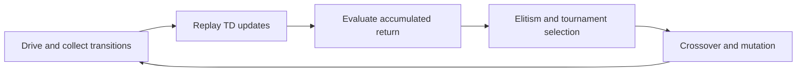

# Learning Lab: Generalization, Value Learning, and Fair Comparisons

This guide treats the games as experiments rather than score demos. It explains
what each learner is estimating, what the current Snake agent actually sees and
optimizes, how to keep random seeds from becoming a hidden training feature, and
how to compare algorithms without quietly changing the task.

## A seed is a control, not a dataset

A pseudorandom seed makes an experiment repeatable. It does **not** make the
result representative. If training and evaluation both use seed `7`, the agent
is repeatedly exposed to one deterministic stream of food locations, exploratory
actions, replay samples, and initial parameters. A high score can then mean
either:

- the policy learned a rule that transfers to new situations; or
- the policy adapted to regularities in that one random stream.

The second case is seed overfitting. It is easy to miss because the environment
still appears random during the run. Given the same program, seed, and software
stack, however, it is the same randomness in the same order.

Snake treats `--seed` as a training root. It derives a tagged seed for every
training episode, while the agent uses the root for its other random mechanisms:

| Source | Current implementation | What it changes |
|---|---|---|
| Environment RNG | Per-episode seed derived with `SeedSequence` | Start pose and food placement |
| Policy RNG | NumPy generator seeded by the training root | Epsilon-greedy exploratory actions |
| Replay RNG | Separate `random.Random` seeded by the training root | Mini-batch samples |
| Model RNG | `torch.manual_seed(training_root)` | Initial network parameters |

Using one experiment seed is convenient and reproducible, but it also couples
these sources. A more diagnostic experiment derives named sub-seeds from a
recorded root seed:

```text
experiment seed
├── environment seed
├── initialization seed
├── exploration seed
└── replay-sampling seed
```

Changing one sub-seed at a time can answer narrower questions—for example,
whether a result depends on favorable network initialization or on favorable
food placements. Per-episode environment streams are implemented. Fully separate
CLI roots for initialization, exploration, and replay sampling remain a useful
future extension.

## Separate training, validation, and final-test seeds

Choose the split before looking at results and never move a difficult evaluation
seed into training. A useful small experiment is:

- training seeds: `101, 202, 303, 404, 505`;
- validation seeds, used for tuning: `1001` through `1010`;
- final test seeds, opened once: `2001` through `2020`.

Each trained checkpoint should be evaluated on **all** seeds in one fixed
validation suite. Changing those scenarios between checkpoints makes their means
incomparable. A second fixed final-test suite stays unopened during training and
model selection. Validation and final testing must freeze the model, optimizer,
target network, epsilon schedule, and replay memory. Use greedy actions
(`epsilon = 0`) unless the experiment explicitly studies a stochastic policy. Do
not train between evaluation episodes.

Report two kinds of variation separately:

1. **Training variation:** how results change when model initialization,
   exploration, and replay order change.
2. **Environment variation:** how one frozen checkpoint performs across unseen
   food layouts or road scenarios.

Snake's `--evaluation-seed` supplies the validation root. If omitted, it defaults
to `training_seed + 1,000,003`. `--final-test-seed` supplies a disjoint final-test
root and defaults to `training_seed + 2,000,003`. Both roots derive fixed ordered
seed lists; the periodic validation list never changes with the validation round.

Periodic validation uses greedy actions without optimizer updates or replay
insertion. `--eval-only` loads the best checkpoint matching the selected
algorithm and, when the environment matches and no seed/count override is given,
replays the exact validation seeds recorded in its metadata. It prints the suite,
seed list, recorded mean, reproduction result, and metrics as JSON. Use
`--eval-suite final_test` for the separately rooted final report. If no compatible
checkpoint exists, the command exits with an explanation; adding `--fresh` is the
explicit way to measure an intentionally untrained baseline.

## Six value-learning configurations

Let `Q(s, a)` denote the expected discounted return after taking action `a` in
state `s`, and let `gamma` be the discount factor. All six configurations below
learn action values, but they differ in representation and in how they construct
the next-state target.

### Tabular Q-learning

Tabular Q-learning stores one value for every discrete state-action pair:

```text
Q(s,a) <- Q(s,a) + alpha * [r + gamma * max_a' Q(s',a') - Q(s,a)]
```

It is off-policy: the behavior may explore, while the target assumes the greedy
next action. It is a valuable baseline because it has no neural-network optimizer,
target synchronization, or replay-buffer effects to confound the result.

Snake's 11 binary observations have at most `2^11 = 2,048` bit patterns and three
actions, so a dense table needs only 6,144 values. Many bit patterns are invalid
or unreachable, which makes a dictionary keyed by the 11-bit state another
natural implementation. The current `q_learning` backend uses that sparse-table
form with learning rate 0.15.

### SARSA and Expected SARSA

Classic SARSA uses the action actually selected by the behavior policy in the
next state:

```text
a' ~ current epsilon-greedy policy
Q(s,a) <- Q(s,a) + alpha * [r + gamma * Q(s',a') - Q(s,a)]
```

It is on-policy. If exploration can drive into a wall, SARSA learns the value of
behaving with that exploration still present and can prefer a wider safety
margin. Q-learning instead estimates the greedy policy even while its behavior
explores.

Snake's CLI name `sarsa` implements **Expected SARSA** instead. It replaces the
sampled `Q(s',a')` with the expectation under the current epsilon-greedy policy:

```text
y = r + gamma * sum_a pi_epsilon(a|s') * Q(s',a)
```

This lowers target variance and does not need to store a sampled next action. The
educational implementation updates online and deliberately skips end-of-episode
replay, because replaying transitions collected under old epsilon values would
weaken its on-policy interpretation.

### DQN

DQN replaces the table with a neural network. The current implementation samples
transitions from replay and uses a periodically copied target network:

```text
y = r                              if terminal
y = r + gamma * max_a Q_target(s',a) otherwise
```

The online network is fitted toward `y` with Huber loss. Replay reduces temporal
correlation, while the delayed target network keeps both sides of the regression
from changing at every optimizer step.

### Double DQN

The `max` in DQN tends to prefer actions whose values are overestimated by noise.
Double DQN separates selection from evaluation:

```text
a* = argmax_a Q_online(s',a)
y  = r + gamma * Q_target(s',a*)
```

The online network chooses; the target network scores that choice. This changes
the target calculation, not the observation, action space, replay memory, or
network size. Snake currently supports both `dqn` and `double_dqn`.

### Dueling DQN

A dueling network shares a feature encoder and then produces two streams:

```text
V(s)       = value of being in the state
A(s,a)     = relative advantage of each action
Q(s,a)     = V(s) + A(s,a) - mean_a A(s,a)
```

Subtracting the mean makes the decomposition identifiable. This architecture is
useful when many actions have similar value because it can learn state quality
without relearning it separately for every action. "Dueling" is an architecture;
"Double" is a target rule, so a dueling Double-DQN agent can use both.

Snake implements both target variants. `dueling_dqn` uses the target network to
select and evaluate the maximum; `dueling_double_dqn` uses online selection and
target evaluation. Both use a shared 11 → 512 → 256 feature trunk followed by a
one-output value head and a three-output advantage head.

### What is implemented today

| Method | Snake CLI | Replay | Target network | Policy relationship |
|---|---|---:|---:|---|
| Tabular Q-learning | `--algorithm q_learning` | End-of-episode batch reuse | No | Off-policy |
| Expected SARSA | `--algorithm sarsa` | No learning replay | No | Current epsilon-greedy target |
| DQN | `--algorithm dqn` | Yes | Yes | Off-policy |
| Double DQN | `--algorithm double_dqn` | Yes | Yes | Off-policy |
| Dueling DQN | `--algorithm dueling_dqn` | Yes | Yes | Off-policy |
| Dueling Double DQN | `--algorithm dueling_double_dqn` | Yes | Yes | Off-policy |

## Snake as a learning problem

The default `standard` board is 640 × 480 pixels on a 20-pixel grid, or 32 × 24
cells. Three additional presets make transfer tests explicit:

| Preset | Pixels | Grid | Learning purpose |
|---|---:|---:|---|
| `tutorial` | 200 × 160 | 10 × 8 | Fast feedback on turns and food direction |
| `compact` | 320 × 240 | 16 × 12 | Tighter walls and shorter routes |
| `standard` | 640 × 480 | 32 × 24 | Default training and evaluation |
| `wide` | 720 × 360 | 36 × 18 | Aspect-ratio and long-route transfer |

Every episode begins with a length-three snake. With domain randomization
disabled it starts in the center heading right. The default curriculum chooses a
valid randomized position and heading with probability 15% from episode 0, 55%
from episode 20, and 100% from episode 75. `--no-curriculum` makes that
randomization immediate; `--no-domain-randomization` restores the fixed spawn.
Food is sampled uniformly from free cells. Moving into the tail cell is legal
when the tail will vacate on that step.

An episode ends on a wall collision, self collision, a filled-board win, or
starvation. The starvation budget is `100 * current snake length` steps since the
last food; eating resets that counter.

### Observation: 11 binary features

| Index | Feature | Exact meaning |
|---:|---|---|
| 0 | danger straight | The next cell in the current heading collides |
| 1 | danger right | The next cell after a relative right turn collides |
| 2 | danger left | The next cell after a relative left turn collides |
| 3 | heading left | Absolute direction is left |
| 4 | heading right | Absolute direction is right |
| 5 | heading up | Absolute direction is up |
| 6 | heading down | Absolute direction is down |
| 7 | food left | Food x-coordinate is left of the head |
| 8 | food right | Food x-coordinate is right of the head |
| 9 | food up | Food y-coordinate is above the head |
| 10 | food down | Food y-coordinate is below the head |

The danger probes are one cell long. The food features reveal direction but not
distance, obstacles, body topology, starvation time, or board occupancy. The
same 11-bit observation can therefore represent different full board states with
different long-term outcomes. This state aliasing sets a ceiling on what any of
the six configurations can infer without memory or richer observations.

### Actions: three relative turns

Actions are strict one-hot vectors:

| Vector | Meaning |
|---|---|
| `[1, 0, 0]` | Continue straight |
| `[0, 1, 0]` | Turn right relative to the current heading |
| `[0, 0, 1]` | Turn left relative to the current heading |

There is no direct reverse action. This keeps the policy egocentric and prevents
an immediate 180-degree turn into the neck.

### Reward used for training

The main training loop calls `Agent.calculate_reward`; it does not train from the
raw reward returned by `SnakeGameAI.play_step`. The effective reward is:

| Event | Training reward |
|---|---:|
| Eat food | `+10` |
| Move one Manhattan step closer to food | `+1` |
| Move one Manhattan step farther from food | `-1` |
| Equal food distance | `0` |
| Revisit a cell during a non-food move | additional `-0.25` |
| Wall or self collision | `-10` |
| Starvation timeout | `-5` |
| Filled-board win | `+35` (`+10` food + `+25` win) |
| Quit | `0` |

Distance shaping makes early learning much denser than food-only reward, but it
also encourages locally shorter moves that may be globally unsafe. The revisit
penalty and timeout discourage loops without proving that every rewarded path is
survivable. Comparisons must keep this reward function fixed.

### Current learners

```text
MLP:      11 binary inputs -> 512 ReLU -> 256 ReLU -> 3 Q-values
Dueling:  11 binary inputs -> 512 ReLU -> 256 ReLU -> value + advantage -> 3 Q-values
Tabular:  sparse rows from at most 2,048 observed bit patterns -> 3 Q-values
```

The replay buffer holds 100,000 transitions. Neural training uses batches of up
to 1,000, Adam at `0.001` with weight decay `0.00001`, 5% dropout, Huber loss,
gradient clipping at 1.0, discount `0.923`, and target synchronization every 100
optimizer updates. The tabular learners use step size 0.15 and the same discount.
Epsilon decays linearly from 1.0 to 0.05 over 200 completed games.

These commands are supported by the inspected CLI:

```bash
# A fresh, reproducible DQN training run
python -m snakeGameQDlearning.main \
  --algorithm dqn --fresh --no-save --headless --games 1000 \
  --seed 101 --evaluation-seed 1001

# Change only the target rule
python -m snakeGameQDlearning.main \
  --algorithm double_dqn --fresh --no-save --headless --games 1000 \
  --seed 101 --evaluation-seed 1001

# Dueling Double DQN on a compact board
python -m snakeGameQDlearning.main \
  --algorithm dueling_double_dqn --environment compact \
  --fresh --no-save --headless --games 1000 \
  --seed 101 --evaluation-seed 1001

# Inspect the small tabular baselines
python -m snakeGameQDlearning.main \
  --algorithm q_learning --environment tutorial \
  --fresh --no-save --headless --games 1000 \
  --seed 101 --evaluation-seed 1001
python -m snakeGameQDlearning.main \
  --algorithm sarsa --environment tutorial \
  --fresh --no-save --headless --games 1000 \
  --seed 101 --evaluation-seed 1001

# Run an explicit fixed validation suite for the best matching checkpoint
python -m snakeGameQDlearning.main \
  --algorithm double_dqn --environment standard --eval-only \
  --eval-episodes 20 --seed 101 --evaluation-seed 2001

# One-time report on the distinct final-test suite
python -m snakeGameQDlearning.main \
  --algorithm double_dqn --environment standard --eval-only \
  --eval-suite final_test --final-test-episodes 20 \
  --seed 101 --final-test-seed 3001

# Visual inspection at a lower rendering rate
python -m snakeGameQDlearning.main \
  --algorithm double_dqn --fresh --speed 30 --seed 101
```

`--games` counts episodes, not environment decisions. Periodic validation
defaults to the same eight episodes every 25 completed games; use
`--eval-every 0` to disable it. `--final-test-episodes` defaults to 20 and has no
effect on training or checkpoint selection.

`--fresh` prevents loading the current best checkpoint, and `--no-save` prevents
comparison runs from writing new ones. Without `--no-save`, qualifying training
or validation improvements write versioned models into the shared
`snakeGameQDlearning/models/saved_models/` directory. Checkpoint metadata filters
loads by algorithm. There is still no CLI option for an isolated output directory,
a decision budget, or an explicit checkpoint path. Account for those limits when
automating comparisons.

Checkpoint metadata records the algorithm, save reason, validation mean,
environment, validation round, curriculum/domain-randomization settings, seed
roots, and the exact validation and final-test seed lists. Loading prefers the
highest validation mean among compatible evaluated checkpoints, with training
score as the legacy fallback. Periodic validation reports mean, standard
deviation, median, minimum, maximum, mean steps, win rate, termination counts,
and the rolling-training-minus-validation generalization gap.

A Snake checkpoint restores the learned network weights or Q table and episode
metadata. It does not restore optimizer state, replay contents, learner RNG
state, or target-synchronization counters, so continuing training is not a
bit-for-bit deterministic resume. Exact greedy evaluation does not require that
training state: it uses the frozen policy parameters and the recorded fixed
suite.

## Driving as a control problem

`drivingGameRL` separates deterministic vehicle dynamics from presentation. Its
`DrivingEnv` has a Gym-like `reset`/`step` contract without requiring Gym, so the
same fixed-step simulation supports manual driving, scripted controllers, four
learning modes, and a human-versus-champion race. The learner is also independent
of Pygame: headless and visual experiments call the same environment, replay,
network, and population code.

### Vehicle state and fixed-step physics

The simulated state contains position, velocity, heading, steering angle, and
damage. Each step projects velocity into longitudinal and lateral components,
blends toward the requested steering angle, applies terrain-aware engine force,
braking, aerodynamic drag, rolling resistance, and lateral grip, and then
integrates position. The default time step is `1/60` second; accepted fixed steps
must be greater than zero and at most `0.1` second.

Important model details are deliberately observable:

- steering authority grows with speed instead of rotating a stationary car at
  full rate;
- reverse steering changes yaw direction;
- low grip leaves measurable lateral velocity and slip rather than snapping the
  car onto its heading;
- steering response is damped progressively at high speed;
- reverse speed is capped at 34% of forward maximum speed;
- a new barrier-contact episode clamps the car to the collision radius, reflects
  and damps its outward velocity, increments damage once, and reports impact
  speed;
- reward and particles consume simulation telemetry rather than inventing
  separate visual physics.

The force terms currently include brake acceleration up to `190`, quadratic
aerodynamic drag `0.0018 * v * abs(v)`, and terrain rolling drag equal to
`115 * rolling_resistance`.

### Components and upgrades

Each component has integer levels 0 through 5. Upgrades alter physical
coefficients, not merely HUD values:

| Component | Level-0 value | Change per level | Level-5 value | Primary effect |
|---|---:|---:|---:|---|
| Motor acceleration | 88 | +13 | 153 | Forward and reverse engine force |
| Motor maximum speed | 205 | +17 | 290 | Forward cap and derived reverse cap |
| Wheel steering rate | 90°/s | +8°/s | 130°/s | Requested steering angle |
| Wheel response | 5.00 | +0.75 | 8.75 | How quickly steering reaches its target |
| Suspension stability | 0.820 | +0.065 | 1.145 | Yaw response and lateral recovery |
| Grip multiplier | 0.840 | +0.055 | 1.115 | Tire traction on every surface |

This separation supports controlled ablations: compare two builds while holding
circuit, action sequence, and seed constant, or train on a stock build and test
whether the policy transfers to different component levels. Do not combine an
algorithm change and a build change in one comparison row.

### Terrain and circuits

Terrain affects grip, rolling resistance, and engine efficiency:

| Surface | Grip | Rolling resistance | Engine efficiency | Tire particles |
|---|---:|---:|---:|---|
| Asphalt | 1.00 | 0.012 | 1.00 | Skids only |
| Wet asphalt | 0.88 | 0.010 | 0.98 | Spray |
| Gravel | 0.76 | 0.035 | 0.91 | Dust |
| Grass | 0.62 | 0.052 | 0.82 | Debris |
| Mud | 0.48 | 0.080 | 0.70 | Mud |
| Sand | 0.54 | 0.095 | 0.66 | Dust |
| Snow | 0.40 | 0.064 | 0.72 | Snow |
| Ice | 0.22 | 0.004 | 0.93 | Skids only |

The five built-in closed circuits exercise different combinations:

| Circuit slug | Character | Surface variation |
|---|---|---|
| `harbor_loop` | Wide, flowing corners | Wet dockside road sector; grass runoff |
| `pine_sprint` | Technical forest layout | Gravel road sector; mud runoff |
| `desert_switchback` | Long straights and tight switchbacks | Gravel and wet road sectors; gravel runoff |
| `alpine_gauntlet` | Fast, narrow sixteen-point mountain loop | Ice, wet, and snow road sectors; snow runoff |
| `canyon_maze` | Eighteen-corner precision course with opposing hairpins | Gravel, sand, and wet road sectors; sand runoff |

Circuit projection is shared by physics, progress, terrain lookup, collision, and
sensors. That prevents the renderer and environment from disagreeing about where
the road is.

### Lap timing and the best-lap ghost

Lap time is deterministic simulation time. Every environment step adds
`fixed_dt`—`1/60` second by default—to the current timer, independent of the
wall clock. Given the same initial state and action sequence, changing the
display frame limit therefore does not change the resulting current, last, or
best time. A valid completion requires the ordered 25%, 50%, and 75% gates plus
a forward start-line crossing; reverse crossings, start-line oscillation, and
implausible projection jumps cannot create a lap. Completing that circuit
increments the completed-lap counter, moves the current time into the last-lap
field, and starts the next timer at zero. The first completed lap establishes
the circuit best; only a strictly faster later lap replaces it.

Each circuit keeps its own best record for the lifetime of one environment. A
record includes the time and sampled car trajectory. `R` resets the car, current
and last timers, completed-lap count, collisions, and current trajectory, but it
retains every circuit's best record. `C` switches circuits and performs the same
run reset; switching back restores that circuit's retained best. Records are
in-memory only, so constructing a new environment or starting a new process
begins without a best lap.

After a record exists, the renderer interpolates its trajectory at the current
lap time and draws a translucent car plus its racing line. This ghost is
presentation-only: it has no collision body and changes neither vehicle physics,
observations, rewards, progress, nor particles. `G` toggles both the ghost and
racing line without disabling trajectory recording. The `--no-ghost` CLI option
starts with this overlay hidden.

### Observation: 12 normalized values

| Index | Label | Meaning |
|---:|---|---|
| 0 | speed | Speed divided by build maximum, clamped to `[0, 1.5]` |
| 1 | longitudinal speed | Signed forward speed divided by maximum |
| 2 | lateral speed | Signed sideways speed divided by maximum |
| 3 | heading error | Track-relative heading error divided by pi |
| 4 | track offset | Signed centerline offset divided by collision radius |
| 5 | terrain grip | Grip coefficient of the current terrain |
| 6 | lap progress | Normalized progress around the circuit |
| 7–11 | five range rays | Normalized clearance at -90°, -45°, 0°, +45°, +90° |

Each ray samples every six simulation units up to a range of 150 and reports
`1.0` when no barrier is found. The observation exposes local geometry, motion,
surface, and progress but not a global circuit map. Generalization should
therefore include held-out circuits and component builds, not only new particle
or environment seeds.

### Actions and reward

The discrete action space is:

| Index | Action | Controls |
|---:|---|---|
| 0 | Coast | No throttle, brake, or steering |
| 1 | Accelerate | Full throttle |
| 2 | Brake | Full brake |
| 3 | Steer left | 72% throttle and full left steering |
| 4 | Steer right | 72% throttle and full right steering |

`step_controls` also accepts continuous throttle, brake, and steering controls
for manual or scripted driving. The shaped reward is the sum of independently
reported terms:

```text
progress  = 0.12 * signed forward distance
road      = +0.025 on road, otherwise -0.08
speed     = 0.018 * max(0, longitudinal_speed) / max_speed
reverse   = -0.05 when longitudinal_speed < -2
collision = -min(5, 0.06 * impact_speed) on contact start; otherwise 0
lap       = +20 after one valid gated forward circuit; otherwise 0
```

The `info` dictionary exposes the active terrain, on-road flag, progress,
completed laps, `lap_completed`, current/last/best lap time, persistent-contact
`collided`, one-shot `collision_started`, impact speed, every reward term, and
vehicle telemetry. Episodes do not currently terminate from damage or collision.
They truncate at the configured step limit, which defaults to 10,800 steps
(three minutes at 60 Hz).

### Driving value network and replay

All driving learners operate on the same 12 observations and five discrete
actions. The deep action-value function is a fully connected network:

```text
12 observations → 128 ReLU → 128 ReLU → 5 Q-values
```

The five outputs estimate the discounted return for coast, accelerate, brake,
steer left, and steer right. In the standalone deep modes, epsilon-greedy action
selection adds exploration and every transition enters a bounded replay memory:

```text
(state, action, reward, next_state, done)
```

Uniformly sampled mini-batches train the online network with Huber loss, Adam,
and gradient clipping. The target network is copied periodically from the online
network. Standard DQN uses the target network for both selection and evaluation:

```text
y_DQN = r + gamma * (1 - done) * max_a Q_target(next_state, a)
```

Double DQN splits those responsibilities:

```text
a*       = argmax_a Q_online(next_state, a)
y_DDQN   = r + gamma * (1 - done) * Q_target(next_state, a*)
```

`--algorithm dqn` and `--algorithm double_dqn` keep one learner across
episodes. In the dashboard, an "episode" is presented as a one-member generation
so the same fitness and history views work for all four modes.

### Genetic neuroevolution

`--algorithm genetic` treats every online-network weight and bias as a genome.
It does not insert replay transitions, run an optimizer, or update a target
network during evaluation. Each member acts greedily for the configured step
budget, and its fitness is exactly its accumulated shaped environment reward:

```text
fitness_i = sum(t=0..T-1) reward_i,t
```

Population evaluation is sequential and seeded. This keeps the visible car equal
to the policy currently earning fitness and avoids worker-timing nondeterminism.
After every member has been evaluated, the next generation is built as follows:

1. Rank the population by fitness, with stable member IDs breaking ties.
2. Copy the configured number of elites without crossover or mutation.
3. Select each pair of parents by seeded tournament selection.
4. Apply either uniform crossover or BLX-alpha blend crossover.
5. Apply masked zero-mean Gaussian noise to the selected child parameters.
6. Synchronize each changed child's target network before evaluation.

Uniform crossover chooses each parameter from one of the two parents. For one
parameter index `j`:

```text
child_j = parent_A,j  when mask_j = 1
          parent_B,j  otherwise
```

Masked Gaussian mutation is:

```text
child_j <- child_j + Bernoulli(mutation_rate) * Normal(0, mutation_std)
```

Strict elitism prevents a good genome from being destroyed by random operators,
while tournament selection still gives weaker genomes a non-zero path into the
next generation. The dashboard reports best, mean, median, and worst fitness,
fitness spread, genome diversity, ancestry, and the active member.

### Hybrid genetic DQN

`--algorithm genetic_dqn` uses the same population and evolutionary operators,
but every member is also a real Double-DQN learner during its evaluation. It acts
epsilon-greedily, stores experience, and performs replay-based TD updates before
its final learned weights are ranked. This creates two time scales:



Gradient descent supplies local improvement within a member's lifetime;
selection and mutation search across initializations and policy regions between
generations. Children inherit network parameters, not replay transitions or
shared optimizer state. This avoids teaching a new policy from experience
collected under a different parent while keeping learned weights heritable.

The hybrid is not automatically superior. It spends more computation per
environment transition and combines two sources of stochasticity. Pure
`genetic` is the clean ablation for the evolutionary contribution, while
standalone `double_dqn` is the clean ablation for population search.

### Live dashboard and the `P` champion race

The 1,400×760 dashboard is a view over learner telemetry; it does not own or
synthesize training state.

| Tab | What it answers |
|---|---|
| Overview | Which member is driving, what it observes and chooses, and how current/best/mean fitness changes across the population and generations |
| Network | Which real layers and connections produced the current Q-values; colors and intensity come from current activations and weights |
| Memory | How full replay is, whether action selection explored, and what loss, TD error, gradient steps, action counts, and target synchronization are doing |

Pressing `P` pauses accelerated training and creates two private environments on
the current circuit. One receives continuous human controls; the other receives
greedy actions from an isolated, frozen clone of the current generation's best
available policy. Both advance at a fixed 60 Hz for one lap. Press `P` again to
return to training. The clone cannot write replay, update gradients, change
generation fitness, or participate in selection, so the race is observational
rather than an extra training episode.

The human uses arrows or `WASD` for throttle/reverse and steering and `Space` for
the brake. A faster training preset changes only how many simulation steps are
processed per rendered frame; it does not change driving physics or race time.

### Driving generalization and overfitting

A high return on `harbor_loop` does not imply a robust driver. The observation is
local and compact, but a large network or population can still specialize to one
circuit's turn sequence, one component build, or reward-shaped behaviors such as
safe slow progress. The hybrid can overfit faster because it has both gradient
updates and population selection amplifying the same training signal.

Use at least three disjoint layers of variation:

- train with several learner seeds and report the distribution, not one champion;
- rotate or randomize training circuits and terrain-heavy sections;
- reserve circuits, component builds, and seeds for frozen-policy evaluation.

Do not use the interactive `P` race as the held-out metric: a human adapts between
races, and repeatedly choosing a favorite champion is itself selection on the
demo. Use it to understand behavior, then report scripted frozen evaluations
under equal environment-decision budgets. For a population run, the interaction
budget per full generation is approximately:

```text
population_size * evaluation_steps
```

### Driving commands and controls

These commands match the inspected CLI:

```bash
# Drive manually on the default circuit with a stock car
python -m drivingGameRL.main

# Compare an upgraded build on a different circuit
python -m drivingGameRL.main \
  --circuit desert_switchback \
  --motor 3 --wheels 2 --suspension 4 --grip 5 --seed 101

# Run the deterministic autopilot without a window
python -m drivingGameRL.main \
  --circuit pine_sprint --headless --steps 3600 --seed 101

# Capture the final autopilot frame
python -m drivingGameRL.main \
  --steps 600 --screenshot driving-lab.png

# Print circuit descriptions and exit
python -m drivingGameRL.main --list-circuits

# Standalone DQN and Double-DQN learning
python -m drivingGameRL.main --learn --algorithm dqn
python -m drivingGameRL.main --learn --algorithm double_dqn

# Pure neural-weight evolution
python -m drivingGameRL.main --learn --algorithm genetic \
  --population 12 --elite-count 2 --evaluation-steps 1800

# Hybrid population-based Double DQN (editable-install launcher)
late-night-driving-rl --algorithm genetic_dqn \
  --population 12 --elite-count 2 --evaluation-steps 1800

# Bounded headless comparisons
python -m drivingGameRL.main --learn --algorithm double_dqn \
  --headless --steps 50000
python -m drivingGameRL.main --learn --algorithm genetic_dqn \
  --headless --generations 20 --population 12

# Resume and persist a compatible population
late-night-driving-rl --algorithm genetic_dqn \
  --checkpoint drivingGameRL/models/checkpoints/hybrid-driver.pth
```

An explicit `--checkpoint` is loaded when it exists and saved on clean exit.
`--fresh` skips loading, while `--no-save` keeps the existing file unchanged.

Without `--learn`, headless mode and any `--screenshot` request enter deterministic
autopilot capture mode, which defaults to 240 steps when `--steps` is omitted.
`--motor`, `--wheels`,
`--suspension`, and `--grip` each accept levels 0 through 5. `--car-sprite` selects
another transparent top-down image, while `--no-sensors` hides only the rendered
rays—not the observation values. `--no-ghost` starts with the best-lap replay and
racing line hidden; recording still runs, and `G` can reveal the overlay later.

| Input | Manual action |
|---|---|
| `W` / Up | Throttle |
| `S` / Down | Reverse throttle |
| `A` / `D` or Left / Right | Steer |
| `Space` | Brake |
| `R` | Reset the current run while retaining per-circuit best records |
| `C` | Cycle circuit |
| `G` | Toggle the best-lap ghost and racing line |
| `V` | Toggle sensor rays |
| `1` / `2` / `3` / `4` | Cycle motor / wheels / suspension / grip |
| `F12` | Save `driving-screenshot.png` |
| `Esc` | Quit |

Learning mode adds these controls:

| Input | Learning action |
|---|---|
| `1` / `2` / `3` | Open Overview / Network / Memory |
| `Tab` | Cycle dashboard tabs |
| `Space` | Pause or resume training |
| `N` | Advance one training step while paused |
| `[` or `,` | Reduce simulation steps per rendered frame |
| `]` or `.` | Increase simulation steps per rendered frame |
| `V` | Show or hide the five exact policy sensor rays |
| `M` | Show or hide isolated rollout cars for the current generation |
| `P` | Enter or leave the fixed-60-Hz race against the frozen generation champion |
| `R` | Reset the current evaluation; start a rematch while racing |
| `S` | Save the current learner checkpoint |
| Arrows / `WASD` | Drive the human car during the race |
| `Space` | Brake during the race |
| `Esc` | Quit |

The five displayed rays are immutable snapshots from the same sampling method
that supplies `ray_left` through `ray_right` to the network. Their endpoints are
therefore measurements, not reconstructed decoration. The `M` comparison view
clones up to twelve current-generation policies into separate identically seeded
environments and advances those clones greedily at fixed simulation time. The
scored training environment is still shown separately. Rollout actions never
enter replay or fitness, and the set is rebuilt when the generation changes.
Use `--population-cars` to begin with this view enabled or `--no-sensors` to
begin with ray rendering disabled.

## Reproducible comparison protocol

Use this protocol across the implemented neural, tabular, and population
baselines.

### 1. Freeze the experiment contract

Record the Git commit, Python and dependency versions, observation ordering,
action ordering, reward constants, board size, episode timeout, discount,
exploration schedule, optimizer, target-sync frequency, and checkpoint rule.
A behavior change creates a new experiment; do not append it to old results.

### 2. Pre-register seed sets

Use several training seeds and a disjoint held-out environment suite. Record the
ordered lists in the result artifact. Never select a checkpoint because it looks
good on final test seeds.

### 3. Give equal interaction budgets

The fairest budget is environment decisions, not wall-clock time or episodes.
Longer-lived policies otherwise receive more learning transitions per episode.
If the current `--games` interface is used, record both games and decisions and
stop all runs at the same predeclared criterion. A decision-budget CLI is still a
recommended upgrade for Snake. For driving populations, count every member's
evaluation steps: 20 generations of 12 members at 1,800 steps is a budget of up
to 432,000 environment decisions, not 36,000.

### 4. Change one factor at a time

For DQN versus Double DQN, keep the same network initialization seed, replay
samples, batch size, epsilon schedule, and target-sync cadence. Only the bootstrap
selection rule should differ. For a dueling comparison, report parameter counts;
the architecture necessarily changes. For tabular methods, report table coverage
and update count rather than pretending neural optimizer steps are equivalent.
For `genetic` versus `genetic_dqn`, keep population size, evaluation budget,
initial weight seeds, elitism, tournaments, crossover, and mutation fixed; report
the hybrid's additional optimizer updates and compute cost. For population versus
standalone DQN, equalize total environment decisions rather than generations.

### 5. Evaluate frozen checkpoints

For every checkpoint and held-out seed:

- disable gradients and optimizer updates;
- disable replay insertion and target synchronization;
- use epsilon 0 unless stochastic evaluation was predeclared;
- run the same number of episodes or scenarios;
- record per-episode return, score, length, termination reason, and wall-clock
  inference time.

If greedy action values tie, use one fixed tie-breaking rule. Random tie-breaking
needs its own recorded evaluation seed.

### 6. Report distributions, not the best run

At minimum, report median and mean score, interquartile range, a confidence
interval across training seeds, win rate, timeout rate, and collision breakdown.
Plot learning against environment decisions with one line per seed plus an
aggregate band. "Best score" is useful for a demo but is a biased estimator of
expected performance.

### 7. Preserve raw evidence

Store a machine-readable row for each evaluation episode, the resolved config,
seed assignments, checkpoint hash, code commit, and dependency lock information.
Keep training curves separate from held-out evaluation results. A minimal result
schema is:

```text
run_id, commit, algorithm, train_seed, checkpoint_step,
eval_seed, episode, return, score, steps, termination_reason
```

### 8. Use paired analysis when possible

Evaluate every algorithm on the same held-out seeds. Compare paired per-seed
differences rather than comparing unrelated averages; difficult scenarios then
affect both algorithms equally. Do not pair runs that used different environment
rules or reward functions.

## Experiment checklist

- [ ] Training, validation, and test seed sets are disjoint.
- [ ] Every algorithm receives the same environment interaction budget.
- [ ] Evaluation performs no learning and uses a declared epsilon.
- [ ] Observation, action, reward, and terminal semantics are identical.
- [ ] Model capacity and parameter count are reported.
- [ ] All seeds and tie-breaking behavior are recorded.
- [ ] Results include every run, not only the best checkpoint.
- [ ] Raw per-episode data and the exact code commit are preserved.
